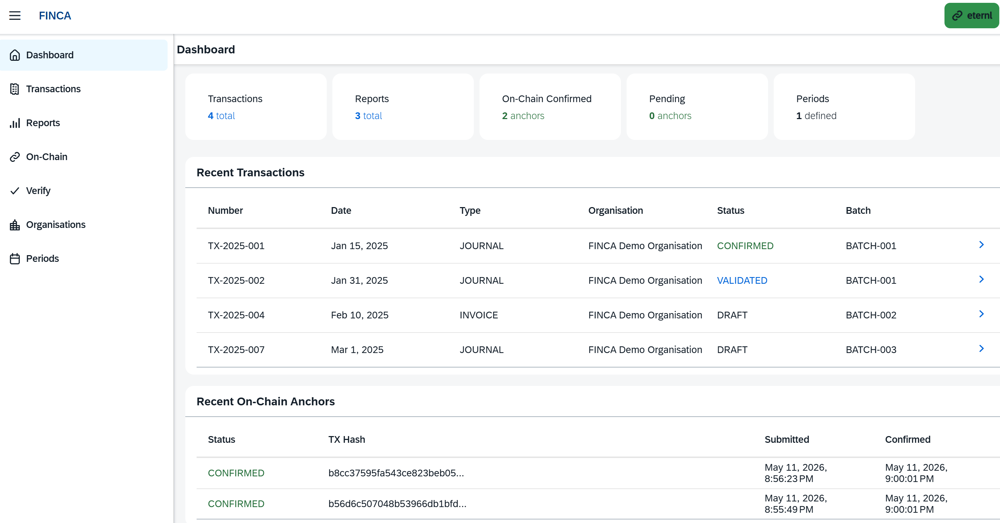
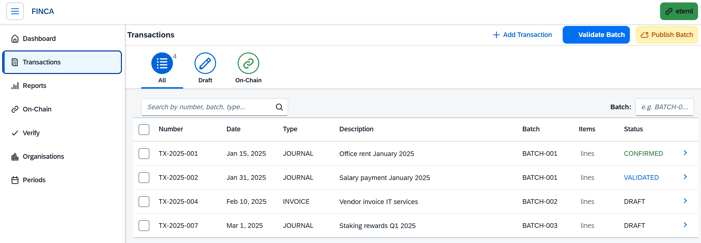
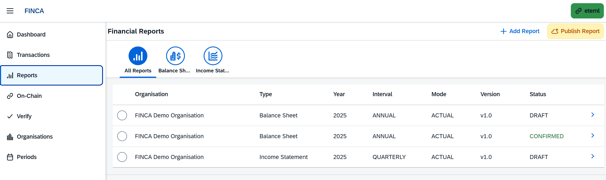
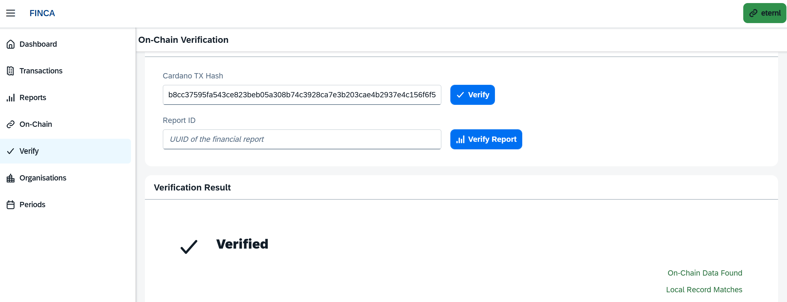

# FINCA — App Preview

Visual tour of the FINCA UI. All screenshots taken on the Preview network with a connected Eternl wallet.

## Dashboard

Landing page after wallet sign-in. KPI tiles surface the number of transactions, reports, confirmed and pending on-chain anchors, and defined accounting periods. Below: the latest transactions and the most recently submitted anchors with TX hash and confirmation time.

## Transactions

Bookkeeping transactions with status filters (All, Draft, On-Chain), full-text search, and batch filtering. `Validate Batch` runs the double-entry consistency check; `Publish Batch` builds the unsigned 1447-metadata transaction through ODATANO and opens the connected wallet's signing flow.

## Financial Reports

Reeve-1447 reports grouped by type (Balance Sheet, Income Statement) with year, interval, mode, and version. Approved reports are anchored via `Publish Report` as a single Cardano transaction; the status flips to `CONFIRMED` once the network confirms the anchor.

## On-Chain Verification

Verifies any TX hash or report ID directly against the chain. Loads the `1447` metadatum from the Cardano node and reports whether on-chain data was found and whether it matches the local record. This is the ultimate proof of integrity for auditors and regulators: the financial data they see in the UI was exactly what was anchored on Cardano, and it hasn't been tampered with since.